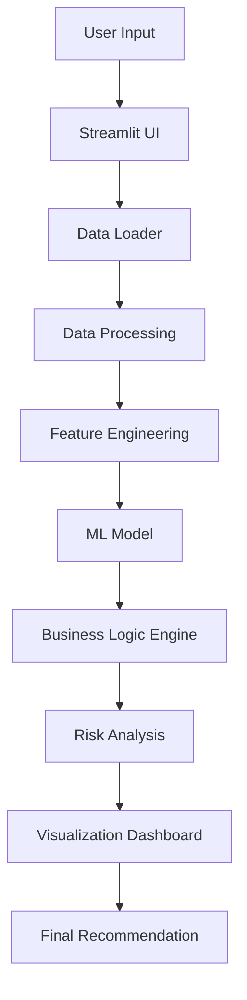

# 🌾 Smart Crop Profit & Risk Prediction System

An AI-powered decision support system that helps farmers **choose the most profitable and least risky crops** using data analytics, machine learning, and real-time insights.

---

## 🚀 Overview

This project is designed to transform traditional farming decisions into **data-driven strategies**.
It integrates historical crop data, statistical analysis, and machine learning to provide:

* 📈 Profit estimation
* ⚠️ Risk assessment
* 🌾 Crop comparison
* 🧠 Intelligent recommendations

> Instead of relying on guesswork, farmers can make **optimized, data-backed decisions**.

---

## 🧠 Key Features

* 🔮 **Profit Prediction Engine**
  Calculates expected profit based on yield, cost, and market price.

* ⚠️ **Risk Classification System**
  Uses statistical measures (Coefficient of Variation) to classify crops into:

  * Low Risk
  * Medium Risk
  * High Risk

* 📊 **Interactive Analytics Dashboard**
  Visual insights using Plotly:

  * Yield comparison
  * Risk distribution
  * Crop variability

* 🤖 **Machine Learning Integration**

  * Model: RandomForestRegressor
  * Predicts crop yield based on historical data

* 📄 **Automated Report Generation**
  Generates downloadable PDF reports with recommendations.

---

## 🏗️ System Architecture



---

## 🔁 Workflow Pipeline

```text
User Input
   ↓
Load Crop Dataset (CSV)
   ↓
Data Cleaning & Preprocessing
   ↓
Feature Engineering (Mean, Std Dev, CV)
   ↓
ML Model Prediction (Random Forest)
   ↓
Profit Calculation (Revenue - Cost)
   ↓
Risk Classification
   ↓
Crop Comparison
   ↓
Visualization + Report Generation
```

---

## 📂 Project Structure

```bash
Smart-Crop-System/
│
├── app.py                # Main Streamlit application
├── model_training.py     # ML model training script
├── requirements.txt      # Dependencies
├── runtime.txt           # Runtime configuration
├── data/
│   └── crop_data.csv     # Dataset
```

---

## ⚙️ Tech Stack

### 🧠 Core Technologies

* Python
* Streamlit
* Pandas, NumPy

### 🤖 Machine Learning

* Scikit-learn (RandomForestRegressor)
* Label Encoding

### 📊 Visualization

* Plotly

### 📄 Reporting

* ReportLab

---

## 📈 Mathematical & Statistical Concepts

* **Mean Yield**

* **Standard Deviation**

* **Coefficient of Variation (CV)**
  → Used for risk classification

* **Profit Formula**

```text
Profit = (Yield × Price) - Cost
```

---

## ▶️ How to Run Locally

```bash
# Clone repository
git clone https://github.com/AGRIM140/Smart-crop-profit-and-risk-prediction-system

# Navigate to project
cd Smart-crop-profit-and-risk-prediction-system

# Install dependencies
pip install -r requirements.txt

# Run app
streamlit run app.py
```

---

## 📊 Example Outputs

* 📈 Crop-wise profit comparison
* ⚠️ Risk categorization dashboard
* 📄 Downloadable crop recommendation report

---

## 💡 Problem Statement

Farmers often rely on:

* Traditional knowledge
* Uncertain weather conditions
* Fluctuating market prices

This leads to:

* Financial losses
* Poor crop selection

---

## ✅ Solution

This system provides:

* Data-driven crop selection
* Risk-aware decision-making
* Profit optimization

---

## 🔮 Future Enhancements

* 🌦️ Real-time weather integration
* 💰 Live mandi price API
* 📱 Mobile application
* 🛰️ Satellite data (NDVI) integration
* 📈 Time-series forecasting

---

## 💼 Resume Description

> Developed an AI-powered Smart Crop Advisory System using machine learning and data analytics to optimize crop selection, predict profitability, and assess agricultural risk through an interactive dashboard.

---

## 🤝 Contributing

Contributions are welcome!
Feel free to fork the repository and submit a pull request.

---

## 📜 License

This project is for educational and research purposes.

---

## 👨‍💻 Author

**Agrim Singh**
B.Tech CSE (Data Science)
Sikkim Manipal Institute of Technology

---


